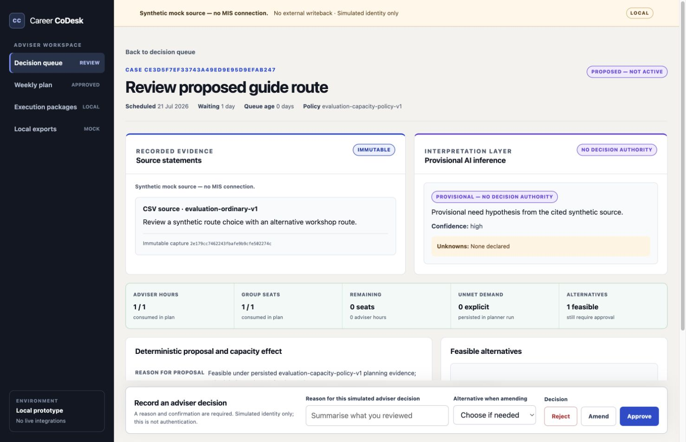
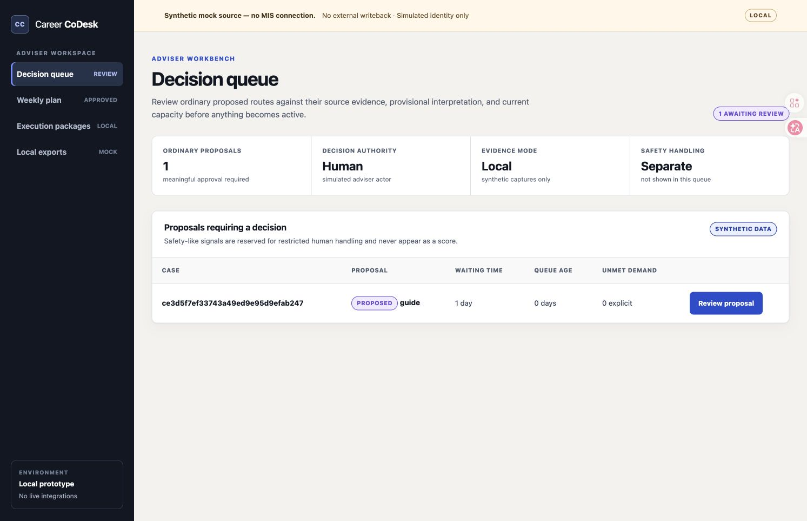
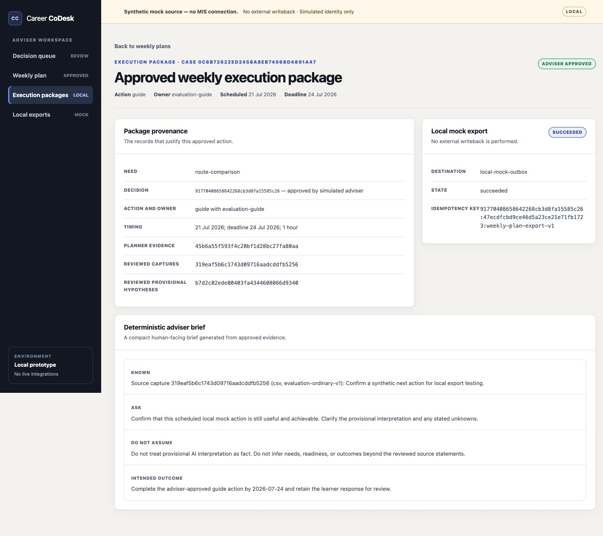
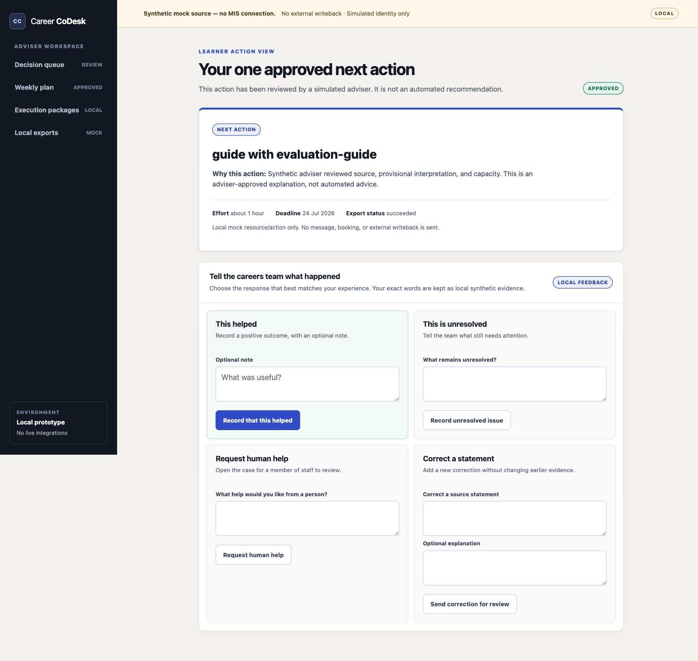

# Career CoDesk

Career CoDesk is a local decision workspace for further education careers teams. It turns synthetic learner needs into a capacity-feasible support proposal, keeps source evidence separate from provisional AI interpretation, and requires an adviser to approve, amend, or reject the proposal before anything becomes an active plan.

This repository contains a complete synthetic demonstrator and the local engineering loop used to build it. It does not use real learner data, connect to an MIS, or write to an external service.



## Product tour

| Synthetic decision queue | Evidence-first adviser review |
| --- | --- |
|  |  |
| Approved weekly execution package | Learner action and feedback |
|  |  |

The screenshots use the checked-in fictional evaluation data. The complete desktop and mobile review is recorded in [design-qa.md](design-qa.md).

## What the demonstrator covers

- Synthetic CSV intake with provenance and sensitive-data checks
- A deterministic fake AI adapter with versioned inputs and outputs
- Capacity planning that records feasible alternatives and unmet demand
- Adviser review with approve, amend, and reject decisions
- An approved weekly plan, local mock export, and learner feedback loop
- A restricted exit for safety-like input before ordinary case processing
- Eight repeatable evaluation scenarios with no runtime network access

Version `0.2.0` is approved only as a local synthetic prototype. It is not a production deployment, authentication system, live integration, safety process, or compliance claim. The full boundary is documented in [the product guide](product/README.md).

## Quick start

Python 3.9.x and [uv](https://docs.astral.sh/uv/) are required. From the repository root:

```sh
uv sync --project product --all-groups --locked
uv run --project product --locked --no-sync python product/manage.py migrate
uv run --project product --locked --no-sync python product/manage.py runserver 127.0.0.1:8000
```

Open `http://127.0.0.1:8000/`.

For a populated demo, first generate the deterministic evidence database:

```sh
bash product/scripts/run-demo-evaluation.sh
CAREER_CODESK_EVALUATION_SQLITE_PATH="$PWD/product/evaluation-output/evaluation-v1.sqlite3" \
  uv run --project product --locked --no-sync python product/manage.py runserver 127.0.0.1:8000
```

Open `http://127.0.0.1:8000/plans/` to begin with the populated, approved plans. Each plan links back to its approval evidence and forward to the learner action. The checked-in sample data is in [product/fixtures/evaluation](product/fixtures/evaluation). The demo uses fictional aliases and an explicit synthetic-data attestation. See the [demo runbook](product/DEMO_RUNBOOK.md) for the expected evidence in each scenario.

## Verify it

```sh
bash scripts/verify-product.sh
bash product/scripts/run-demo-evaluation.sh
python3 -m unittest discover -s tests
python3 -m loop_engine doctor --no-model-check
```

Product verification covers 91 tests, Django system checks, migration consistency, formatting, lint, and static collection. The evaluator covers happy path, over-capacity, malformed input, AI failure, restricted safety exit, adviser override, failed local export, and reopened case scenarios.

## How Codex and GPT-5.6 were used

The repository includes a Symphony-inspired engineering loop in [loop_engine](loop_engine). [PLAN.yaml](PLAN.yaml) breaks the project into isolated implementation runs. [WORKFLOW.md](WORKFLOW.md) assigns GPT-5.6 Sol with ultra reasoning to read-only guidance and review, GPT-5.6 Terra to design and implementation, and GPT-5.6 Luna to explicitly selected low-risk work. Deterministic commands, rather than a model, decide whether verification passes.

Codex ran each agent implementation task in its own local branch and worktree. A high-level guide first narrowed the task to its acceptance criteria. An implementer then changed only the allowed paths. A separate reviewer checked the exact candidate tree, and the loop allowed one concentrated repair cycle before requiring human input. Human gates approved the product direction and the final synthetic demonstrator.

This workflow used Codex interfaces and GPT-5.6 model routing. It did not require an application API integration or API credits. The loop records task state, validation results, review decisions, and accepted commits locally so the build can be inspected instead of relying on a chat transcript.

### Codex development record

| Phase | Work recorded |
| --- | --- |
| Product discovery | Formed the product hypotheses and theory, then checked the source product information. |
| Delivery design | Built the coding plan and introduced the Codex guide, implementation, verification, and review loop. |
| Implementation | Ran the main loop-driven build in Codex CLI. The corresponding `/feedback` ID is supplied directly to Devpost rather than published in this repository. |

## Three-minute demo

Open the standalone [video presentation](docs/video-demo.html) in a browser. It uses only local files, includes keyboard navigation and a three-minute timer, and links to the live local demo. Presenter cues can be shown while practising and hidden before recording. The detailed recording order and voiceover prompts remain in [SUBMISSION.md](SUBMISSION.md). Session IDs belong in the Devpost form, not the public repository.

## Repository map

- [product](product): Django demonstrator, tests, fixtures, and evaluation pack
- [docs/versions/v0.2.0-implementation-rfc.md](docs/versions/v0.2.0-implementation-rfc.md): approved prototype scope and decisions
- [PLAN.yaml](PLAN.yaml): task graph and human gates
- [WORKFLOW.md](WORKFLOW.md): model roles, safety boundaries, and completion rules
- [docs/loop-engineering.md](docs/loop-engineering.md): loop operator guide
- [docs/video-demo.html](docs/video-demo.html): offline three-minute presentation and live-demo launcher
- [design-qa.md](design-qa.md): desktop and mobile visual review
- [SUBMISSION.md](SUBMISSION.md): Devpost copy, video script, and final checklist

## Original project materials

The early product definition and research notes remain available as dated source material. They are not presented as validated market, legal, or institutional claims.

- [product_definition.md](product_definition.md)
- [Adoption Rates of Triage and Digital Tracking Systems in UK FE Colleges.md](Adoption%20Rates%20of%20Triage%20and%20Digital%20Tracking%20Systems%20in%20UK%20FE%20Colleges.md)
- [英国学院职业发展痛点.md](英国学院职业发展痛点.md)
